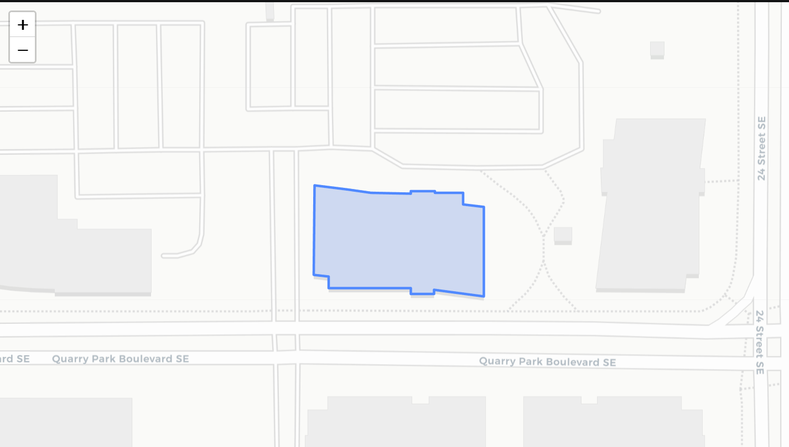

# Rooftop PV POC

Estimates PV system size and energy production for a given address using a footprint polygon and PVWatts API call

## INPUTS

`address` building address

`pct_roof_area_available` fraction of roof area vailable for PV

## How It Works

1. **Get Building Footprint**: retrieves the building footprint for a given address from OpenStreetMap via the Overpass API
2. **Calculate Available Roof Area**: Computes the footprint area and applies a custom availability factor
3. **Size PV System**: Calculates system capacity based on available area and an arbitrary panel density (0.20 kW/m²)
4. **Get PV Energy Production**: Queries NREL's PVWatts API for location-specific solar irradiance and annual energy production potential
5. **Visualize Results**: Generates an interactive map showing the building footprint overlay

## Project Files

`env_utils.py` handles geospatial and visualtzation data processing

`pvwatts_api.py` NREL PVWatts API call

`main.ipynb` main workflow combining the above modules.

## Dependencies

```
requests
shapely
pyproj
folium
webbrowser
```


## Example Output

For AECOM headquarters in Calgary, AB:

```
Estimated available roof area for PV: 1,684.4 m²
Estimated PV system size: 336.9 kW
Estimated annual energy production: 322,900 kWh
```

**Building Footprint Map:**



The blue outlined polygon shows the extracted building footprint overlaid on the street map.

## API Keys

- **Komoot Photon**: Public, no key required
- **Overpass**: Public; rate limits apply (use multiple URLs with fallback)
- **NREL PVWatts**: Requires API key (free registration at https://developer.nlr.gov/signup/)

Update the `API_KEY` in `pvwatts_api.py` with your own key

